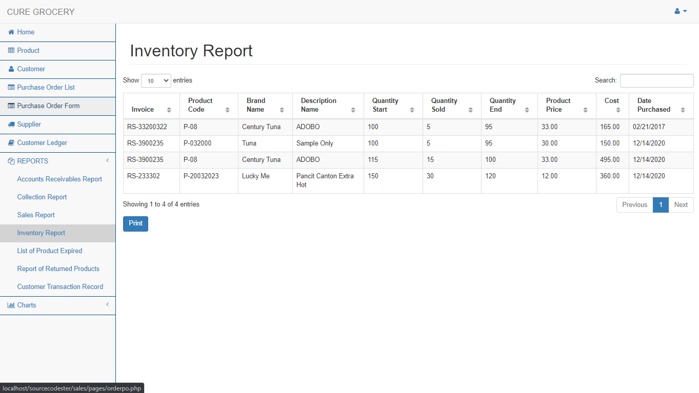

# Sales and Inventory System for Grocery Store using PHP/PDO

  

### Description

The CURE Grocery Sales and Inventory System will help the business track sales activity easily, inventory and to ensure that transactions are completed correctly. With the use of the system, the retrieval process will speed up and be able to generate immediate sales and inventory reports.

### Features
<ul>
  <li><strong>Manage Supplier</strong></li>
  <li><strong>Manage Product</strong></li>
  <li><strong>Manage Customer</strong></li>
  <li><strong>Point of Sale</strong></li>
  <li><strong>Manage Purchase Order</strong></li>
  <li><strong>Customer Ledger</strong></li>
  <li><strong>Accounts Receivables Report</strong></li>
  <li><strong>Collection Report</strong></li>
  <li><strong>Sales Report</strong></li>
  <li><strong>Inventory Report</strong></li>
  <li><strong>Report of Returned Products</strong></li>
  <li><strong>Customer Transaction Record</strong></li>
  <li><strong>Graph by Category</strong></li>
  <li><strong>Graph For Cash and Credit</strong></li>
  <li><strong>Graph For Losses</strong></li>
  <li><strong>Monthly Sales Chart</strong></li>
  <li><strong>Yearly Sales Chart</strong></li>
</ul>

Visit [sourcecodester.com](https://www.sourcecodester.com/php/11238/sales-and-inventory-system-grocery-store.html) for more detailed information about this Grocery Store's Sales and Inventory System in PHP.

| Title | Sales and Inventory System for Grocery Store using PHP/PDO Full Source Code |
|:--|:--|
| Website | [www.sourcecodester.com](https://www.sourcecodester.com) |
| Link | https://www.sourcecodester.com/php/11238/sales-and-inventory-system-grocery-store.html |
| Language | PHP |
| Uploader/Developer | [renzy_ivan](https://www.sourcecodester.com/users/renzyivan) |

